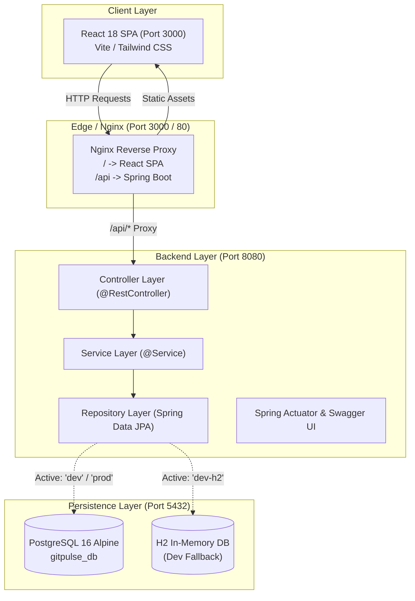

# ⚡ GitPulse - Engineering Productivity & Telemetry Engine

[](https://github.com/gitpulse/gitpulse/actions/workflows/ci.yml)
[](https://adoptium.net/)
[](https://spring.io/projects/spring-boot)
[](https://www.postgresql.org/)
[](https://react.dev/)
[](https://vitejs.dev/)
[](https://www.docker.com/)
[](https://opensource.org/licenses/MIT)

> **GitPulse** is a modern, full-stack engineering telemetry platform that synthesizes GitHub repository activity, commit velocity, pull request cycles, and contributor metrics into actionable developer insights.

---

## 🌟 Key Features

- 📊 **Real-Time Git Analytics:** Visualize commit velocity, PR cycle time, issue resolution latency, and code review throughput.
- ⚡ **Strict Layered Backend:** Java 17 + Spring Boot 3.2 enterprise architecture with explicit DTO validation, JPA repositories, and global exception handling.
- 🎨 **Modern React Dashboard:** Ultra-responsive React 18 + Vite frontend with Tailwind CSS and dark-mode native styling.
- 🐳 **Full Containerization:** Multi-stage Docker builds with Nginx reverse proxy and PostgreSQL 16 healthchecked orchestration.
- 🚀 **1-Command Dev Runner (`dev.ps1`):** Unified Windows PowerShell script that auto-provisions databases, manages profiles, runs backend/frontend concurrently, and streams color-coded logs.
- 🛡️ **Zero-Downtime Resilience:** Automatic fallback from PostgreSQL to an in-memory H2 database if Docker is unavailable.

---

## 🏗️ System Architecture



---

## 📁 Repository Structure

```
gitpulse/
├── .github/
│   └── workflows/
│       └── ci.yml               # GitHub Actions CI (Maven test, Node build, Docker check)
├── backend-spring/              # Java 17 / Spring Boot 3.2 Microservice
│   ├── Dockerfile               # Multi-stage Maven + Eclipse Temurin 17 JRE
│   ├── pom.xml                  # Maven dependencies & build setup
│   └── src/
│       ├── main/
│       │   ├── java/            # Layered architecture (controller, service, repository, etc.)
│       │   └── resources/       # application.yml, application-dev.yml, application-prod.yml
│       └── test/                # Unit & Integration tests
├── frontend/                    # React 18 + Vite Web Application
│   ├── Dockerfile               # Multi-stage Node 20 + Nginx Alpine
│   ├── nginx.conf               # Nginx reverse proxy (/api) & SPA fallback config
│   ├── package.json             # NPM dependencies & scripts
│   ├── vite.config.ts           # Vite configuration & dev proxy
│   └── src/
│       ├── components/          # Reusable UI widgets
│       ├── pages/               # Page views (Dashboard, Analytics, Repositories)
│       ├── services/            # Dedicated API client (api.ts)
│       └── hooks/               # Custom React hooks
├── docker-compose.yml           # Multi-service orchestration (Postgres, Backend, Frontend)
├── dev.ps1                      # 1-Click Windows PowerShell concurrent dev runner
├── .gitignore                   # Comprehensive ignores for Java, Node, Docker, IDEs
├── LICENSE                      # MIT License
├── CONTRIBUTING.md              # Contributor guide & coding standards
├── CODE_OF_CONDUCT.md           # Community Covenant 2.1
└── README.md                    # Project documentation
```

---

## 🚀 Quick Start Guide

### Option 1: 1-Click Concurrent PowerShell Runner (Recommended for Local Dev)

Simply execute `dev.ps1` from PowerShell:

```powershell
.\dev.ps1
```

#### What happens behind the scenes:
1. **Checks Prerequisites:** Validates Java 17 and Node.js versions.
2. **Database Detection:**
   - Detects if PostgreSQL is running on port `5432`.
   - If not, automatically starts the `gitpulse-postgres` Docker container.
   - If Docker is unavailable, automatically switches Spring Boot to the `dev-h2` in-memory database.
3. **Concurrent Launch:** Boots Spring Boot (`:8080`) and Vite dev server (`:3000`) concurrently.
4. **Unified Colored Logging:** Streams `[BACKEND]` and `[FRONTEND]` logs in real-time.
5. **Clean Teardown:** Press `Ctrl+C` to gracefully terminate all child processes.

#### Additional Runner Flags:
```powershell
# Force in-memory H2 database mode
.\dev.ps1 -DbMode h2

# Run only the backend
.\dev.ps1 -SkipFrontend

# Run only the frontend
.\dev.ps1 -SkipBackend
```

---

### Option 2: Full Docker Compose (Production Simulation)

To spin up the entire containerized stack:

```bash
docker compose up --build -d
```

| Service | Host Port | Internal Port | Description |
| :--- | :--- | :--- | :--- |
| **Frontend** | `3000` | `80` | Nginx web server & `/api` reverse proxy |
| **Backend** | `8080` | `8080` | Java Spring Boot REST API |
| **PostgreSQL** | `5432` | `5432` | PostgreSQL 16 Alpine database |

Stop services:
```bash
docker compose down
```

---

## 🌐 Application Endpoints & Ports

| Endpoint | URL | Description |
| :--- | :--- | :--- |
| **Frontend Web App** | [http://localhost:3000](http://localhost:3000) | React 18 interactive analytics dashboard |
| **Backend API Root** | [http://localhost:8080/api](http://localhost:8080/api) | Spring Boot REST API base endpoint |
| **Health Check (Actuator)**| [http://localhost:8080/actuator/health](http://localhost:8080/actuator/health) | Application & database health status |
| **H2 Console (Dev Mode)** | [http://localhost:8080/h2-console](http://localhost:8080/h2-console) | In-browser H2 database explorer |

---

## 🛠️ Development & Coding Guidelines

GitPulse follows strict principles for beginners and experienced engineers alike:

- **Strict Layer Separation:** Controllers only handle HTTP contracts; Services house business logic; Repositories manage persistence.
- **Constructor Injection:** Field `@Autowired` is prohibited to prevent circular dependencies and aid unit testing.
- **Verbose Structured Logging:** Use `@Slf4j` with explicit `log.info()` and `log.error()`.
- **Global Error Handling:** All exceptions are caught via `@ControllerAdvice`.
- **API Decoupling:** In React, all network communication lives in `src/services/api.ts`.
- **Seamless React Bounce:** The root CSS applies dark mode backgrounds to `html, body, #root` to eliminate white bounce flashes during native scrolling.

For more details, see [CONTRIBUTING.md](file:///c:/Users/hy180/OneDrive/Desktop/passion%20project/gitpulse/CONTRIBUTING.md).

---

## 🧪 Continuous Integration & Testing

Automated testing is configured in `.github/workflows/ci.yml` and executes on every push and pull request:
- **Backend Tests:** Runs `mvn clean test` against a live PostgreSQL service container.
- **Frontend Quality:** Runs `npm run lint` and `npm run build`.
- **Container Build Checks:** Verifies multi-stage Docker builds for both microservices.

To run tests locally:
```bash
# Backend tests
cd backend-spring
./mvnw clean test

# Frontend build verification
cd ../frontend
npm run build
```

---

## 📄 License

This project is licensed under the MIT License - see the [LICENSE](file:///c:/Users/hy180/OneDrive/Desktop/passion%20project/gitpulse/LICENSE) file for details.
